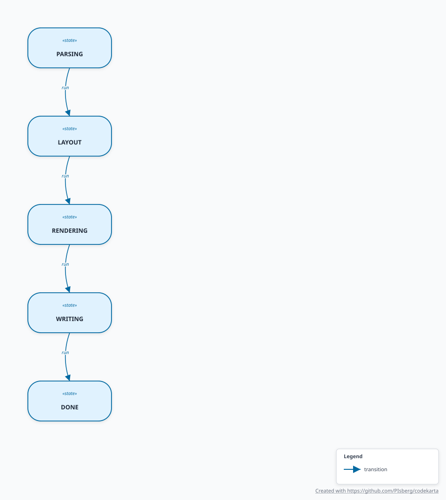

# code-karta

[](LICENSE)
[](https://central.sonatype.com/artifact/se.deversity.codekarta/code-karta)
[](https://github.com/PIsberg/codekarta/actions/workflows/build.yml)
[](https://github.com/PIsberg/codekarta)
[](https://github.com/PIsberg/codekarta)
[](https://github.com/PIsberg/codekarta)
[](https://github.com/PIsberg/codekarta/blob/main/code-karta-cli/src/test/java/se/deversity/codekarta/cli/ArchitectureRulesTest.java)
[](https://pmd.github.io/)
[](https://spotbugs.github.io/)
[](https://jspecify.dev/)
[](https://checkstyle.org/)
[](https://errorprone.info/)
[](https://cyclonedx.org/)
[](https://github.com/PIsberg/codekarta/actions/workflows/build.yml)
[](https://github.com/PIsberg/codekarta)
[](https://paypal.me/isbergpeter)

code-karta is a Java architecture mapping tool. It parses Java source and emits SVG diagrams for
modules, class relationships, method call sequences, exception flow, stitched multi-file call
graphs, and enum-backed state machines.

<p align="center">
  <a href="docs/diagrams/class-diagram.svg">
    
  </a>
  <br/>
  <em>code-karta's own graph IR, diagrammed by code-karta.</em>
</p>

## Quick Start

```bash
mvn clean package

java -jar code-karta-cli/target/code-karta-cli-0.3.0-all.jar \
  --input example-shipping-system/src/main/java/com/karta/shipping/domain \
  --output output
```

Common modes:

```bash
# JPMS module diagram
java -jar code-karta-cli/target/code-karta-cli-0.3.0-all.jar \
  --input example-shipping-system/src/main/java/module-info.java \
  --output output

# Single-file sequence and exception-flow diagram
java -jar code-karta-cli/target/code-karta-cli-0.3.0-all.jar \
  --input example-shipping-system/src/main/java/com/karta/shipping/core/OrderProcessor.java \
  --output output

# Multi-file stitched call graph — OrderProcessor→InventoryService across files
java -jar code-karta-cli/target/code-karta-cli-0.3.0-all.jar \
  --input example-shipping-system/src/main/java/com/karta/shipping/core \
  --output output \
  --sequence-only

# State transition diagram — KartaCli's own pipeline (PARSING→LAYOUT→RENDERING→WRITING→DONE)
java -jar code-karta-cli/target/code-karta-cli-0.3.0-all.jar \
  --input code-karta-cli/src/main/java/se/deversity/codekarta/cli/KartaCli.java \
  --output output \
  --state-machine
```

## Examples

code-karta generates six diagram types, and the ones below are generated **from code-karta's own
source** on every `mvn verify`. Click a thumbnail for the full-size vector SVG, or read
[`docs/DIAGRAM-GALLERY.md`](docs/DIAGRAM-GALLERY.md) for the command and explanation behind each.

| | |
|:--:|:--:|
| [](docs/diagrams/module-diagram.svg)<br/>**📦 Module** — JPMS dependencies and exported packages | [](docs/diagrams/class-diagram.svg)<br/>**📐 Class** — inheritance and composition, stdlib filtered out |
| [](docs/diagrams/kartacli-sequence-diagram.svg)<br/>**🔥 Exception-Flow Sequence** — calls plus colour-coded exception routes and try/catch regions | [](docs/diagrams/callsequenceparser-sequence-diagram.svg)<br/>**📞 Call-Only Sequence** — the same call graph without exception noise |
| [](docs/diagrams/sequence-diagram.svg)<br/>**🔗 Multi-File Stitched** — cross-class calls resolved by JavaParser symbol solving | [](docs/diagrams/kartacli-state-machine-diagram.svg)<br/>**🔄 State Transition** — states from enums, switch cases, and builder DSLs |

For large or highly coupled systems there is a self-contained
[interactive viewer](docs/diagrams/viewer.html) with search, edge-type toggles, and zoom —
see [`docs/VIEWER.md`](docs/VIEWER.md).

## Documentation

| Page | What it covers |
|---|---|
| [`docs/README.md`](docs/README.md) | Documentation index |
| [`docs/BUILD.md`](docs/BUILD.md) | Maven and Gradle commands, running from source |
| [`docs/CLI.md`](docs/CLI.md) | Full flag reference |
| [`docs/MAVEN-PLUGIN.md`](docs/MAVEN-PLUGIN.md) | Generating diagrams from a Maven build |
| [`docs/DIAGRAM-MODES.md`](docs/DIAGRAM-MODES.md) | What each input shape produces |
| [`docs/LIBRARY.md`](docs/LIBRARY.md) | Using the tiers directly from Java |
| [`docs/ARCHITECTURE.md`](docs/ARCHITECTURE.md) | Tier responsibilities, graph schema, extension points |
| [`docs/QUALITY.md`](docs/QUALITY.md) | The `mvn verify` quality gate |
| [`docs/SKILL.md`](docs/SKILL.md) | Compact operating guide for coding agents |

## Using it in a company

| Page | What it covers |
|---|---|
| [`COMPATIBILITY.md`](COMPATIBILITY.md) | What is public API, what is not, and what a version bump means |
| [`SECURITY.md`](SECURITY.md) | Threat model, supported versions, how to report a vulnerability |
| [`CONTRIBUTING.md`](CONTRIBUTING.md) | Build gate, architecture rules, what a pull request needs |
| [`CODE_OF_CONDUCT.md`](CODE_OF_CONDUCT.md) | Contributor Covenant 2.1 |
| [`LICENSE`](LICENSE) | MIT |

## Modules

| Module | Purpose |
|---|---|
| `code-karta-core` | Shared graph IR |
| `code-karta-input` | JavaParser-based source analysis |
| `code-karta-layout` | Simple and ELK layout engines |
| `code-karta-render` | SVG rendering |
| `code-karta-cli` | Command-line wrapper |
| `code-karta-maven-plugin` | Maven goal that drives the CLI during a build |

No tier imports from a sibling or from a tier above it — the `Graph` IR is the only contract that
crosses tier boundaries, and [`ArchitectureRulesTest`](code-karta-cli/src/test/java/se/deversity/codekarta/cli/ArchitectureRulesTest.java)
enforces that with ArchUnit rather than convention.

## 💛 Support code-karta

code-karta is built and maintained by a single developer in his spare time. If it saves you time,
a small donation helps keep the project alive:

- **[Donate via PayPal](https://paypal.me/isbergpeter)** — every contribution, however small, is appreciated.
- Don't have PayPal yet? **[Sign up with this invite link](https://www.paypal.com/webapps/mch/cmd/?v=3.0&t=1784460151&fdata=OBcGAzRHBBYcHAQeSFRMKk90PRgwNE9jVWhoGjAsS0gtRmZpYAd8bEJTbQlgWnlVaFVQX3cFTEdaUUwTRBFMSy50aF1xaV11Q357XWt5UlFdUX5sbQtpdFdGdFcnAS9HcCRJR3QDVVVORltJHUVcU19nfFtzZF9jV2poTjYhDkhMJ2Z5bwZwZkNRYwFhWHpfYFZdV3UCXEdYU0xRTlRMKk90BiQWGDoHV2hqTng4BAgAAmZ5GBNpOBUOOwImCScKNBAfAyENHhMUHQwCVE9XBw88J1B.a09jVWhoHzUhDkhMJ2Z5aQV4ZURWdBlySWoFOQVJRwMWTCk3IyQkaFRMSU90Kgs1cE8CV2h5TnhrS0gICSM8LBNpFVVGZABiWHheYVdcVmIWTkdYEwwZSVRMKk90fl59Yll0QHFwV2F4XlBfVXNhbBNpdlVGIUg9AS9HcCRJR3UCXl5NRFVAHkVeWVthfFNyaFljV2poTi9pSylMRnR2aBNpdlVGIUtwSQtHcFVfXncDW1ZIRVxRDFZMSwc7PRwgDgcmV2gJTnh-Ul9VV3JgaQZ-ZEVTZw1kUX9WcEVLR2JeAxIPFTITQhEIS08VaEsLNBY2VgssHC1oKwoZDig2eRNrdFUKJl8OAzsPcEUoR2J-IDYrNT4jZDojOU90aktkMA02HyYnMDAsS0gtRmZvaQN8YUFQZgxmX3lfZFBbV3METEdaUUwRTgEEBQAKKgUhNE9jNmhoPTwuDxsfBisHMVw-PAACClkODjkPNAoMR2IUTEcQHhkVXyoeDx8KOw82NBpjVwloTj8pBhoIRmZ7eRMhOwAGNkwiDTpHcCRJR3MZXUdYU0xRThoYBBonMEtkEU9jJQxoTnppSxweAiMHPUo8MAYJNFQ9EWpHEUVJACJbHgNYUU5RDDw-NS0ZACkOBSYQI2hoL3hpDAgBFCJ5eRFpdAQVMEs0BioSOAsGOTdOHQNYUS1RDENYWVZhfV98YF5xT3h9Wm17Xl5MRmR5eUYvJx0DdBkRSWpRZVxbUXYAWVJJR11JGUNfU11laEtmcE8vHT0uHTw5Aw1MRgd5eQUpZBdUNA9jWXIAZldeX3QHXlcbEV0UThMLDAgzLwwjNE9jVWhoGSo8Aw1MRgd5eQEtZ0VeYAFpWXIAZ1BfA3MFWQJNSAwVGxMIW1Y2fg50cE9hV2g7Cj8hDkhMJ2Z5bwZwZkNRYwFhWHpfYFZdV3UCXEdYU0xRSA0dAxwsFh42cE8CV2h4WGF8Xl9cV3JpeRNrdFUCIRlwKGpHEighJQgWTEVYURkXWVRMKk90IR4xIR1nRQhsXR9tWC8aEDB2KFMxJRULe1s-BW5UFwcPFmYFKwseHUhCawcIDAsnOw83dF0EHyc9Cjc8T1opCiwsPxd6YwAUJ1s0TXgiaQYJCi8&cks=ZjgxYjY4YjRlNDZjYWM1NWM4NTU1YWViMmI3YThmYjI&e=1.0)** — free for you, and PayPal gives the project a referral bonus.
