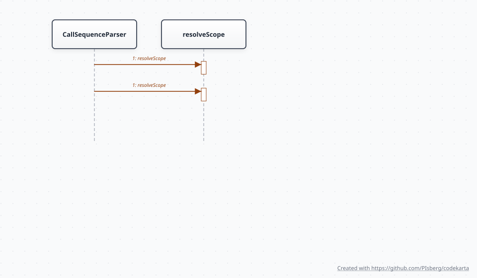
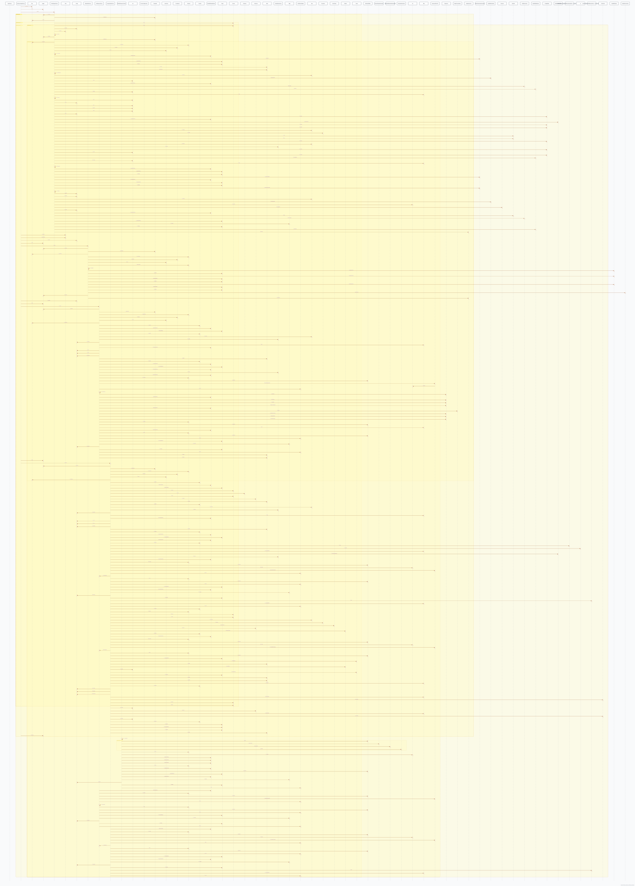

> *This document is regenerated automatically by the build.*
>
> Each section demonstrates a diagram type that code-karta can produce.
>
> **Regenerate:** `mvn verify -DskipTests` or `./gradlew :code-karta-cli:generateDiagrams`
>
> **Skip generation:** `mvn verify -DskipTests -DskipDiagrams=true` or `./gradlew :code-karta-cli:generateDiagrams -PskipDiagrams`

# code-karta Architecture

code-karta is a three-tier pipeline that turns Java source into SVG diagrams:

```text
code-karta-core    -> pure IR data model: Graph, Node, Edge, Group
code-karta-input   -> Java source parsing into the IR
code-karta-layout  -> coordinate assignment
code-karta-render  -> SVG output
code-karta-cli     -> command-line orchestration
```

No tier imports from a sibling or from a tier above it. The `Graph` object is the only contract that crosses tier boundaries.

## 1. Core IR Model - Class Diagram

Generated from `code-karta-core/src/main/java/com/karta/core/model`:

```bash
java -jar karta.jar \
  --input code-karta-core/src/main/java/com/karta/core/model \
  --output docs/diagrams
```

The IR carries enough structure to describe module, class, and sequence diagrams. `NodeDimensions` is the shared default sizing source for layout and rendering.


## 2. Example Module Structure - Module Diagram

Generated from `example-shipping-system/src/main/java/module-info.java`:

```bash
java -jar karta.jar \
  --input example-shipping-system/src/main/java/module-info.java \
  --output docs/diagrams
```

The shipping fixture declares JPMS `requires` and `exports` relationships. The parser maps modules and packages to nodes, then maps module dependencies and exported packages to `REQUIRES` and `EXPORTS` edges.


## 3. CLI Entry Point - Exception-Flow Sequence Diagram

Generated from `KartaCli.java` in default file mode:

```bash
java -jar karta.jar \
  --input code-karta-cli/src/main/java/com/karta/cli/KartaCli.java \
  --output docs/diagrams
```

`KartaCli` is the composition layer for parsing, layout, rendering, and file output. Default single-file parsing includes method calls, try/catch boundaries, and checked exception propagation when JavaParser can identify them.


## 4. Parser Call Chain - Call-Only Sequence Diagram

Generated from `CallSequenceParser.java` with `--sequence-only`:

```bash
java -jar karta.jar \
  --input code-karta-input/src/main/java/com/karta/input/parser/CallSequenceParser.java \
  --output docs/diagrams \
  --sequence-only
```

`--sequence-only` emits ordered `CALLS` edges without exception-flow analysis. Use it when a compact call graph is more useful than exception propagation details.



## 5. Input Layer Call Graph - Multi-File Stitched Sequence

Generated from the full `code-karta-input` source root with `--sequence-only`:

```bash
java -jar karta.jar \
  --input code-karta-input/src/main/java \
  --output docs/diagrams \
  --sequence-only \
  --layout elk
```

Directory input plus `--sequence-only` parses all Java files below the directory into one graph. JavaParser symbol solving is anchored at the input root, and resolved callees use qualified `ClassName.method` node IDs so calls can connect across files.

For accurate cross-package resolution, point `--input` at a source root such as `src/main/java`.



## Layout Engines

Two layout engines implement `LayoutEngine` and are selected with `--layout`.

| Flag | Engine | Algorithm |
|---|---|---|
| `--layout simple` | `SimpleLayoutEngine` | Breadth-first depth levels arranged in a row/column grid. This is the default. |
| `--layout elk` | `ElkLayoutEngine` | Eclipse Layout Kernel layered layout with crossing reduction and routed edges. Falls back to simple layout on failure. |

ELK is recommended for large or dense graphs where the simple grid becomes too wide.

## Diagram Type Summary

| Input | Diagram type | Output filename |
|---|---|---|
| `module-info.java` | Module diagram | `module-diagram.svg` |
| directory | Class diagram | `class-diagram.svg` |
| `.java` file | Exception-flow sequence | `<name>-sequence-diagram.svg` |
| `.java` file plus `--sequence-only` | Call-only sequence | `<name>-sequence-diagram.svg` |
| directory plus `--sequence-only` | Multi-file stitched sequence | `sequence-diagram.svg` |
