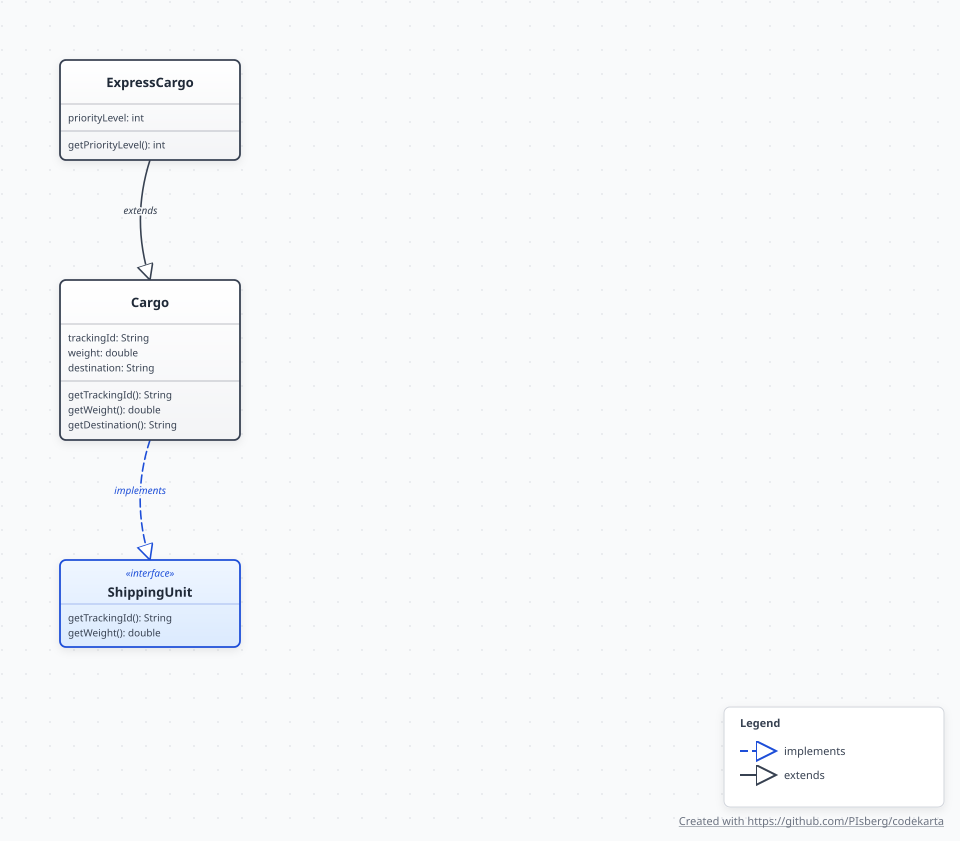
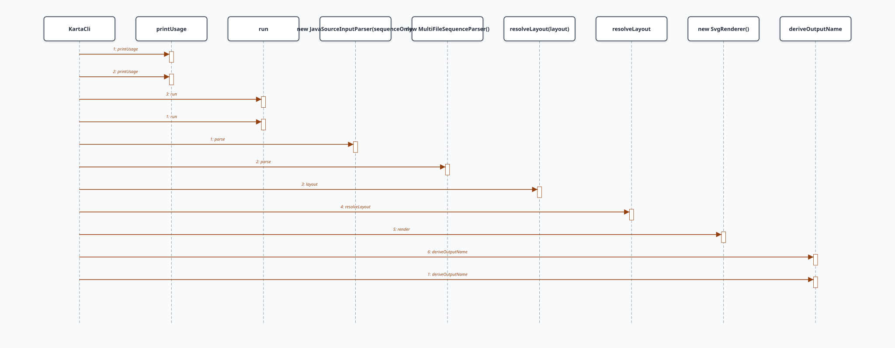
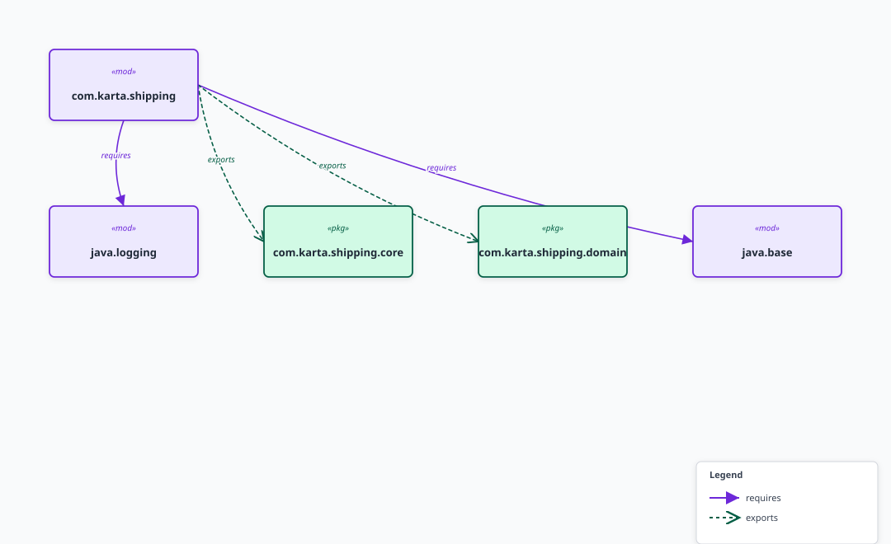

# Architecture — code-karta

## Overview

code-karta is a compiler-style, 3-tier pipeline. Each tier is a separate Maven/Gradle module with a strict contract: the only shared currency is the **Intermediate Representation (IR)** — a flat JSON-serialisable graph defined in `code-karta-core`.

```
  Source files
       │
       ▼
┌─────────────────────┐
│  code-karta-input   │  Tier 1 — AST Extraction
│  JavaSourceInputParser
│  ModuleInfoParser   │  module-info.java → MODULE/PACKAGE nodes, REQUIRES/EXPORTS edges
│  ClassDiagramParser │  directory        → CLASS/INTERFACE nodes, EXTENDS/IMPLEMENTS/HAS edges
│  CallSequenceParser │  *.java file      → METHOD nodes, CALLS edges (ordered by sequence label)
└─────────┬───────────┘
          │  Graph (nodes + edges, no coordinates yet)
          ▼
┌─────────────────────┐
│  code-karta-layout  │  Tier 2 — Spatial Layout
│  SimpleLayoutEngine │  BFS depth → row/column grid; sets x, y, width, height on every Node
└─────────┬───────────┘
          │  Graph (same object, Node coordinates now populated)
          ▼
┌─────────────────────┐
│  code-karta-render  │  Tier 3 — Vector Output
│  SvgRenderer        │  class/module → UML boxes, bezier edges, per-color markers
│  SequenceDiagramRenderer (auto-dispatched for interaction graphs)
└─────────┬───────────┘
          │  SVG string
          ▼
┌─────────────────────┐
│  code-karta-cli     │  Driver
│  KartaCli           │  auto-detects diagram type, calls all three tiers,
│                     │  writes <name>.svg to --output dir (default: ./output/)
└─────────────────────┘
          │
          ▼
  diagrams/*.svg   ← open in any browser or IDE
```

**Design rule:** No tier imports from a tier beside or below it. `input` never calls layout; `layout` never calls render; `render` never calls parsers.

---

## Module Reference

### `code-karta-core`

Pure data model, no logic. All other modules depend on this.

| Class | Role |
|---|---|
| `Node` | A graph vertex: `id`, `type`, `label`, `properties`. Optionally annotated with `x`, `y`, `width`, `height` by the layout tier. |
| `Edge` | A directed connection: `id`, `sourceId`, `targetId`, `type`, `label`. |
| `Group` | A named cluster of node IDs (namespace, module boundary, package). |
| `Graph` | Container for `nodes[]`, `edges[]`, `groups[]`. Provides `addNode`, `addNodeIfAbsent`, `findNode` helpers. |

All classes carry `@JsonInclude(NON_NULL)` — layout fields are absent from serialisation until Tier 2 runs, keeping the JSON compact for LLM consumption.

---

### `code-karta-input`

Parses Java sources into the Core IR using [JavaParser](https://javaparser.org/).

| Class | Input | Nodes produced | Edges produced |
|---|---|---|---|
| `ModuleInfoParser` | `module-info.java` | `MODULE`, `PACKAGE` | `REQUIRES`, `EXPORTS` |
| `ClassDiagramParser` | directory of `.java` files | `CLASS`, `INTERFACE` | `EXTENDS`, `IMPLEMENTS`, `HAS` |
| `CallSequenceParser` | single `.java` file | `CLASS`, `METHOD` | `CALLS` (integer sequence label) |
| `ExceptionFlowParser` | single `.java` file | `CLASS`, `METHOD`, `EXCEPTION` | `CALLS`, `EXCEPTION_PROPAGATION` + try/catch `Group`s |
| `JavaSourceInputParser` | any path | delegates based on path type | — |

**Fault-tolerance guarantee:** every parser wraps all JavaParser calls in `try/catch`. Malformed or unparseable files log a warning and return a partial graph — the pipeline never crashes.

`ClassDiagramParser` filters out standard-library field types (`String`, `List`, primitives, etc.) and strips generic parameters before matching (`List<Node>` → `List`) to keep the graph focused on domain classes. It also populates `Node.properties` with truncated field/method summaries for UML compartment rendering.

---

### `code-karta-layout`

Reads the flat IR graph and assigns absolute coordinates to every node.

| Class | Algorithm |
|---|---|
| `LayoutEngine` | Interface: `Graph layout(Graph graph)` — returns the same instance |
| `SimpleLayoutEngine` | BFS from root nodes (no incoming edges) → assigns depth levels. Each depth = one row; siblings within a row = columns. Node size: 150 × 50 px; H gap: 50 px; V gap: 80 px. |
| `ElkLayoutEngine` | Eclipse Layout Kernel layered (Sugiyama) algorithm — layer assignment, crossing minimisation, node placement, edge routing. Falls back to `SimpleLayoutEngine` on error. |

The layout engine mutates `Node` objects in-place. Isolated nodes fall back to level 0. Cyclic graphs seed BFS from the first node.

**Swap-out:** implement `LayoutEngine` to plug in Eclipse ELK or Graphviz without touching any other module.

---

### `code-karta-render`

Converts a spatially-annotated `Graph` into an SVG document string.

`SvgRenderer` is the entry point. It automatically detects interaction graphs (METHOD nodes + integer-labelled CALLS edges) and delegates to `SequenceDiagramRenderer`.

| Class | Handles |
|---|---|
| `SvgRenderer` | Class diagrams, module diagrams — UML boxes, curved edges, per-color markers, compartments |
| `SequenceDiagramRenderer` | Sequence/exception-flow diagrams — lifelines, message arrows, activation bars, try/catch frames |

**Generic path rendering rules (`SvgRenderer`):**
- Nodes with `null` coordinates are silently skipped (handles partial graphs safely).
- Nodes → `<rect class="node-rect">` + `<text class="node-label">` + `<title>` tooltip.
- CLASS/INTERFACE nodes with `properties["fields"]` / `properties["methods"]` get UML 3-compartment boxes with divider lines and auto-height.
- Edges → quadratic-bezier `<path class="edge-line">` with perpendicular bow; per-color arrowhead markers generated dynamically in `<defs>`.
- Groups → `<rect class="group-rect">` bounding-box with subtle fill.
- All user-visible strings are XML-escaped.

**Sequence path rendering rules (`SequenceDiagramRenderer`):**
- Participant lanes derived from METHOD node-id prefixes; EXCEPTION nodes pinned last.
- Messages DFS-ordered by integer CALLS label from entry methods.
- Dashed `stroke-dasharray="6,4"` lifelines, activation bars, and self-call loops.
- EXCEPTION_PROPAGATION arrows in dashed red; try/catch `Group`s become UML region frames.

**Style injection:** `SvgRenderer.render(graph, cssString)` replaces the embedded stylesheet. All visual elements use stable CSS class names so diagrams can be themed without modifying Java code.

---

## Example Output

### Class diagram (`docs/diagrams/class-diagram.svg`)



### Sequence diagram (`docs/diagrams/kartacli-sequence-diagram.svg`)



### Module diagram (`docs/diagrams/module-diagram.svg`)



---

### `code-karta-cli`

Thin driver that wires all three tiers together and handles file I/O.

```
main(args)
  └─ run(inputPath, outputDir)
       ├─ JavaSourceInputParser.parse(inputPath)   → Graph  [Tier 1]
       ├─ SimpleLayoutEngine.layout(graph)          → Graph  [Tier 2]
       ├─ SvgRenderer.render(graph)                 → String [Tier 3]
       ├─ Files.createDirectories(outputDir)
       └─ Files.writeString(outputDir / name, svg)
              │
              ▼
         outputDir/
           module-diagram.svg          (from module-info.java input)
           class-diagram.svg           (from directory input)
           <name>-sequence-diagram.svg (from *.java file input)
```

`run()` is a public static method so it can be tested directly without spawning a subprocess.

**Output location:** controlled by `--output` (default `./output/` relative to the working directory).
The example project's pre-generated diagrams are at `example-shipping-system/diagrams/`.

---

## IR Schema

The IR is designed to be token-efficient for LLM consumption (spec requirement).
A serialised class-diagram graph looks like:

```json
{
  "nodes": [
    { "id": "Cargo",        "type": "CLASS",     "label": "Cargo",        "x": 20,  "y": 150, "width": 150, "height": 50 },
    { "id": "ShippingUnit", "type": "INTERFACE",  "label": "ShippingUnit", "x": 220, "y": 20,  "width": 150, "height": 50 },
    { "id": "ExpressCargo", "type": "CLASS",      "label": "ExpressCargo", "x": 20,  "y": 280, "width": 150, "height": 50 }
  ],
  "edges": [
    { "id": "Cargo-implements-ShippingUnit",    "sourceId": "Cargo",        "targetId": "ShippingUnit", "type": "IMPLEMENTS" },
    { "id": "ExpressCargo-extends-Cargo",       "sourceId": "ExpressCargo", "targetId": "Cargo",        "type": "EXTENDS"    }
  ],
  "groups": []
}
```

`null` fields are omitted by Jackson `@JsonInclude(NON_NULL)`.

---

## Extension Points

| What to extend | How |
|---|---|
| Add a new layout algorithm | Implement `LayoutEngine`, pass it to `KartaCli.run()` |
| Add a new output format (PDF, Mermaid, DOT) | New module depending only on `code-karta-core`; implement a renderer class |
| Add a new language parser (Kotlin, Python via Tree-sitter) | Implement `InputParser`; register in `JavaSourceInputParser` |
| Custom CSS themes | Pass a CSS string to `SvgRenderer.render(graph, css)` |
| Annotation-driven grouping | Extend `ClassDiagramParser` to detect `@Component`, `@Service`, etc. and populate `Group` objects |
